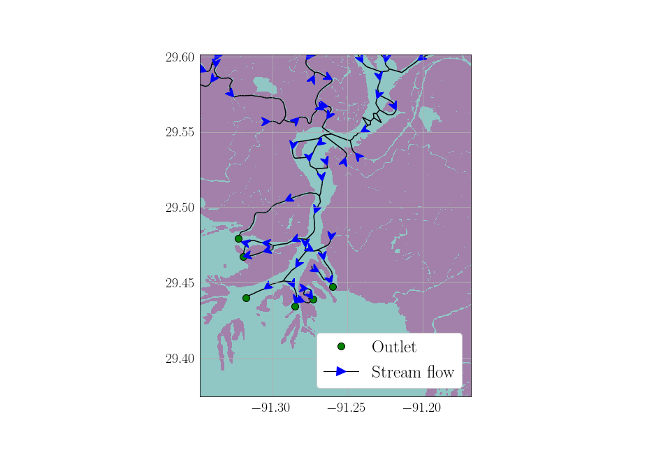

# Orinoco

>Orinoco is a delta in Venezuela and literally means “a place to paddle” in Warao, but refers to a place being navigable.

Orinoco is a tool to leverage python GIS tools to generate river networks from a water mask and a source/sink area (e.g. the ocean).

Products:

+ A networkx directed Graph that can be used for additional analysis.
+ River Centroids and Centerlines (corresponding to the network's nodes and edges, respectively)

Notebooks:

+ Examples:
	+ Using Stamen Terrain tiles and Google map tiles, create a simple water mask over the Wax Lake and Atachfalaya River Deltas
	+ Obtain the channel network and related products
	+ Compute the normalized entropy rate over the subnetwork related to the Wax Lake Outlet
	
+ Validation with GRWL:
	+ Compare the widths from GRWL and orinoco over the Mackenzie Delta
	+ Geographically inspect errors

We generate the river network using scikit-fmm, skimage, networkx, geopandas, shapely, etc. See example in [notebooks](notebooks) to see how these products are generated.

# Installation

Both of these installations are based on python 3.7+ using anaconda and conda within a separate virtual environment.

## Generally

1. Create a virtual environment using the `requirements.txt`
2. Install orinoco downloading this repo and `pip install .`

We contributed to a GIS and remote sensing tutorial with related instructions setting up the environment [here](https://github.com/cmarshak/sari-tutorial).

## Mac

These have been tested with anaconda distribution using the conda package manager. We assume you have downloaded the repo and have your terminal open with this repo as your current working directory.

1. `conda create --name orinoco_env python=3.7`
2. `conda activate orinoco_env`
3. `pip install -r requirements.txt`
4. `pip install .`
5. Ensure your python can be found by jupyter via `python -m ipykernel install --user`

## Windows

These have been tested with anaconda distribution using the conda package manager. We assume you have downloaded the repo and have your Anaconda prompt open with this repo as your current working directory.

1. `conda create --name orinoco_env python=3.7`
2. `conda activate orinoco_env`
3. `conda install -c conda-forge --yes --file requirements.txt`
4. `pip install .`
5. Ensure your python can be found by jupyter via `python -m ipykernel install --user`

# Related Work

Below are related projects and rough checklist of the products that can be extracted.

+ RivWidth [[repo](http://uncglobalhydrology.org/rivwidth/)][[paper](https://ieeexplore.ieee.org/document/4382932)] - IDL

	- [x] Widths
	- [x] Centerlines
	- [] Graph Structure

+ RivGraph [[repo](https://github.com/jonschwenk/RivGraph)] [[paper](https://esurf.copernicus.org/articles/8/87/2020/)] [[poster](https://www.researchgate.net/publication/329845073_Automatic_Extraction_of_Channel_Network_Topology_RivGraph)] - python
	
	- [x] Widths
	- [x] Centerlines
	- [x] Graph Structure

+ Rivamap [[repo](https://github.com/isikdogan/rivamap)][[paper](http://www.isikdogan.com/files/isikdogan2017_rivamap.pdf)] - python

	- [x] Widths
	- [x] Centerlines
	- [] Graph Structure

+ ChanGeom [[repo](https://www.burchfisher.com/data.html)][[paper](https://www.burchfisher.com/uploads/3/8/8/3/38838315/fisher_etal_geomorph_2013.pdf)] - Matlab

	- [x] Widths
	- [x] Centerlines
	- [] Graph Structure

+ Centerline [[repo](https://github.com/fitodic/centerline)] - python

	- [] Widths
	- [x] Centerlines
	- [] Graph Structure

